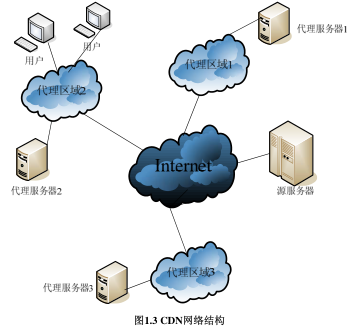
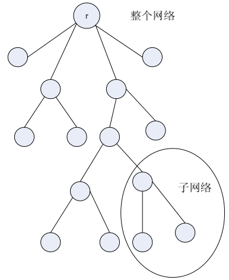

# CDN内容分发网络优化方法的研究_王玮

## 1. 绪论

1. 多层次的C/S结构，服务器分为**源服务器和边缘(代理Proxy)服务器**。对应我这里的**Provider和Transmitter**。

2. 论文结构：
   - 第一章：背景
   - **第二章：数学规划问题，结合CDN**
   - **第三章：运营商CDN**
   - 第四章：启发式算法
   - 第五章：总结

## 2. CDN网络技术研究现状

### 2.1 CDN的主要技术

1. PUSH与PULL：
   - PULL被动分发技术，按需分发。针对相对冷门的内容
   - PUSH主动分方法技术，冷门的内容。

### 2.2 最优化理论简述

1. 线性规划
2. 整数规划

### 2.3  CDN网络与最优化模型结合现状

主要关注两方面：

1. **服务器的放置**：如何选择放置代理服务器的地理位置。对应这里**Transmitter的放置**。
2. **内容的拷贝**：代理服务器位置已经确定，如何将内容拷贝到各个服务器 。

#### 2.3.1 代理服务器的放置（重要）

1. **Kazem理论。**

2. 网络的目标：减小全局网络流量，缩短用户端时延。

3. 使用树形网络拓扑，**根节点为源服务器（Provider），叶子结点为用户，中间的其他结点为边缘服务器或代理服务器（Transmitter）**。

4. 具体公式见论文。

   - 优化目标

   $$
   min\ cost = \sum_{v \in T} W(v)d(v,c(v,P))
   \\
   st. |P|=M
   $$

   - 解释：
     - 整体目标为最小化成本，共有$T$个结点，每个结点$v$分别计算成本后累加。
     - $W(v)$：结点的权重，结点的网络流量大小。
     - $c(v,P)$：距离v最近的Proxy，在树形拓扑结构上为父节点。
     - $d(v,c(v,P))$：距离
     - 限制proxy的个数$|P|$为$M$个
   - 时间复杂度为$O(N^3M^2)$

#### 2.3.2 内容调度

#### 2.3.3 本章小结

2002年以后，研究服务器的放置的文章逐渐变少，取代的是研究如何在代理服务器上拷贝热点内容，即智能的PUSH策略

## 3. 商用内容分发模型研究 

### 3.1 前提条件与说明

### 3.2 数学模型的建立

## 4.  模型求解与仿真

## 5. 总结与展望

